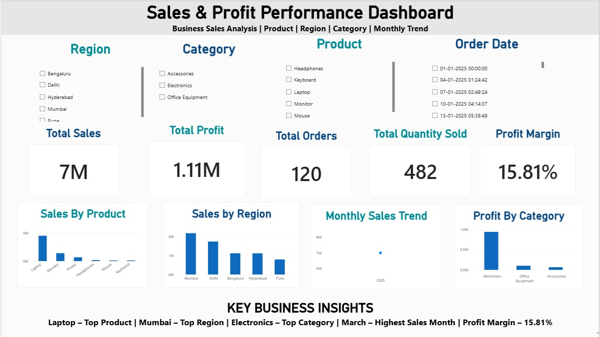
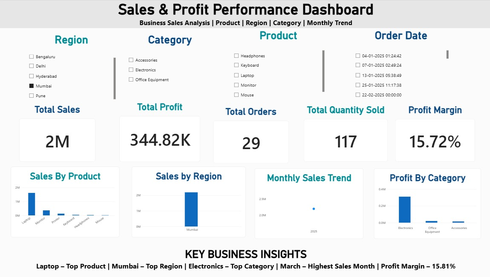

# 📊 Sales Data Analysis

## 📌 Project Overview

This project analyzes sales data to identify product, regional, category, and monthly sales trends. The analysis was performed using Python, and an interactive dashboard was created using Power BI.

## 🛠️ Tools & Technologies

- Python
- Pandas
- NumPy
- Matplotlib
- Jupyter Notebook
- Power BI
- DAX

## 📁 Project Structure

```text
sales-data-analysis/
├── sales_data.csv
├── sales_analysis.py
├── sales_analysis.ipynb
├── Sales_Profit_Performance_Dashboard.pbix
├── sales_dashboard.png.png
├── sales_dashboard_with_Filter.png.png
├── requirements.txt
└── README.md
```

## 📊 Analysis Performed

- Data cleaning and preprocessing
- Exploratory Data Analysis (EDA)
- Product-wise sales analysis
- Region-wise sales analysis
- Category-wise sales and profit analysis
- Monthly sales trend analysis
- Identification of top-performing products, regions, and categories

## 💡 Key Business Insights

- **Laptop** was the best-selling product, generating sales of **₹45.21 lakh**.
- **Mumbai** was the top-performing region, generating sales of **₹21.94 lakh**.
- **Electronics** was the highest-selling category, generating sales of **₹59.28 lakh**.
- **March 2025** recorded the highest monthly sales of **₹11.80 lakh**.
- The overall **profit margin was 15.81%**.

## 📈 Power BI Dashboard

The interactive Power BI dashboard includes:

- KPI Cards
- Product-wise Sales Analysis
- Region-wise Sales Analysis
- Category-wise Performance
- Monthly Sales Trends
- Interactive Filters

### Dashboard Overview



### Interactive Dashboard with Filters



## 🖥️ Power BI Dashboard File

The complete interactive Power BI dashboard file is available in this repository:

[Download Power BI Dashboard](./Sales_Profit_Performance_Dashboard.pbix)

## 🚀 Skills Demonstrated

- Data Cleaning
- Exploratory Data Analysis
- Data Visualization
- Business Insights
- Python Programming
- Power BI Dashboard Development
- DAX

## 👩‍💻 Author

**Aarti Walke**

Aspiring Data Analyst
